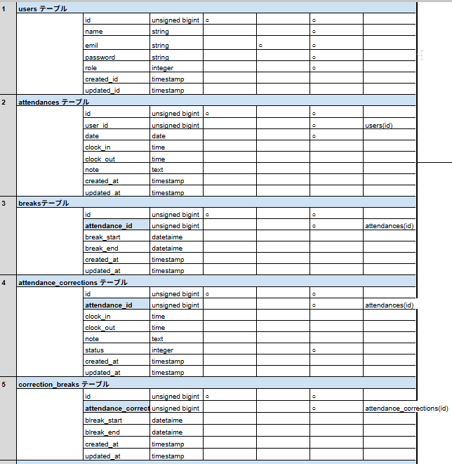
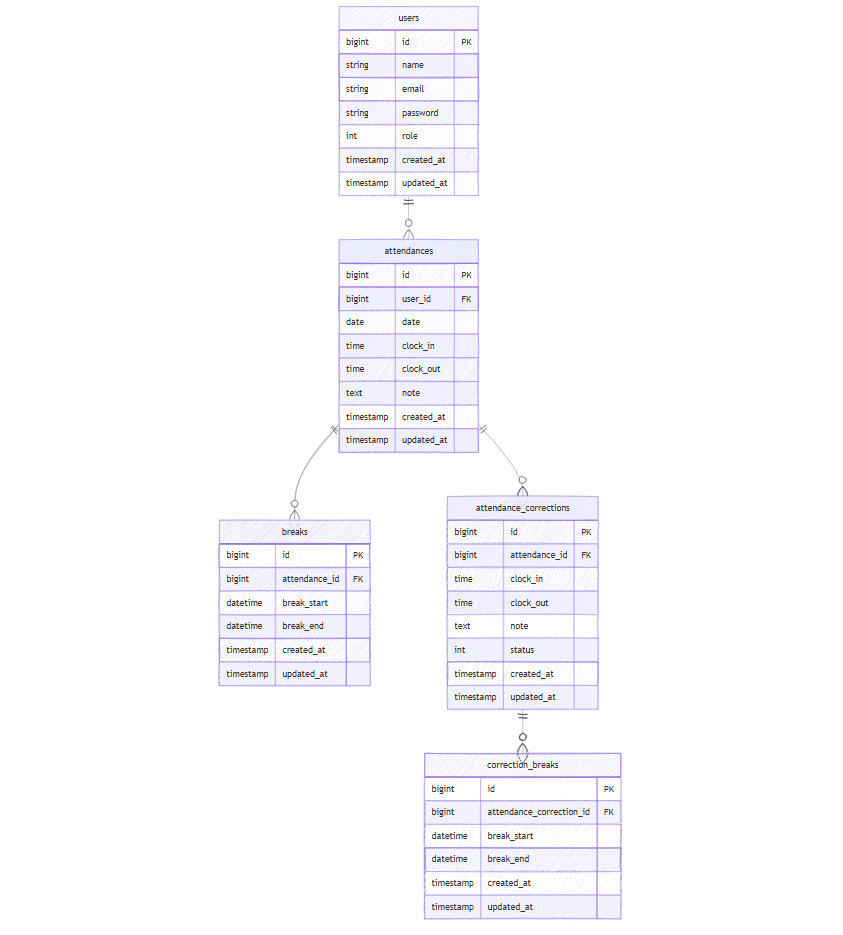

# Coachtech attendance-app（模擬案件）

## 環境構築

### Docker ビルド

1. リポジトリをクローン

```bash
git clone git@github.com:yutaka-fujise/attendance-app.git
```

2. プロジェクトディレクトリへ移動

```bash
cd attendance-app
```

3. Docker Desktop アプリを起動

4. Docker コンテナをビルド・起動

```bash
docker-compose up -d --build
```

※Mac の M1・M2 チップの PC の場合

no matching manifest for linux/arm64/v8 in the manifest list entries
のエラーが表示され、ビルドできない場合があります。

その際は docker-compose.yml の mysql サービスに
以下の記述を追加してください。

```yaml
mysql:
  platform: linux/x86_64
  image: mysql:8.0.26
```

## Laravel 環境構築

1. PHP コンテナに入る

```bash
docker-compose exec php bash
```

2. パッケージをインストール

```bash
composer install
```

3. .env ファイルを作成

```bash
cp .env.example .env
```

環境によっては .env ファイル編集時に権限エラーが発生する場合があります。
その場合は以下を実行してください。
```bash
chmod 666 .env
```

4. アプリケーションキー作成と権限設定

```bash
php artisan key:generate
```
※データベース設定およびメール認証に必要な Mailhog の設定は .env.example に記載済みです。

Laravelが書き込みを行うディレクトリの権限設定
```bash
chmod -R 777 storage bootstrap/cache
```


5. マイグレーションとシーディングの実行

```bash
php artisan migrate --seed
```

6. シンボリックリンク作成

```bash
php artisan storage:link
```

## 管理者アカウント

以下のアカウントで管理者ログインが可能です。

- メールアドレス: admin@example.com
- パスワード: password

## 使用技術（実行環境）

- PHP 8.x
- Laravel 10.x
- MySQL 8.0
- Docker / Docker Compose
- Laravel Fortify

## 機能一覧

### 一般ユーザー
- ユーザー登録
- ログイン / ログアウト
- メール認証
- 出勤打刻
- 休憩開始 / 休憩終了
- 退勤打刻
- 勤怠詳細確認
- 勤怠修正申請
- 勤怠一覧（月次表示）
- 修正申請一覧確認

### 管理者
- 管理者ログイン / ログアウト
- 日次勤怠一覧確認
- 勤怠詳細確認 / 修正
- スタッフ一覧確認
- スタッフ別月次勤怠一覧確認
- 修正申請一覧確認
- 修正申請承認
- CSV出力

## テスト
- 以下のコマンドでテストを実行できます。
```bash
php artisan test
```

### テスト内容
- ログイン画面が正常に表示されることの確認
- ユーザーがログインできることの確認

## テーブル設計


## ER 図


## URL

- 開発環境: http://localhost
- phpMyAdmin: http://localhost:8080/
- ユーザーログイン画面: http://localhost/login
- 管理者ログイン画面: http://localhost/admin/login

## 補足

- ユーザー認証機能には Laravel Fortify を使用しています。

- 一般ユーザーと管理者でログイン導線を分けています。

- メール認証には Mailhog を使用しています。  
  http://localhost:8025 で送信されたメールを確認できます。

- 修正申請機能では、申請内容を別テーブルで管理し、承認後に勤怠データへ反映する構成としています。

- Docker 環境下での再現性を重視した構成としています。

## 工夫した点

### 修正申請機能の設計

勤怠データとは別に修正申請用テーブルを設け、承認前のデータと確定データを分離しました。  
これにより、誤ったデータの上書きを防ぎつつ、承認フローを安全に管理できる構成としています。

### 休憩時間の複数管理

1回の勤務に対して複数回の休憩を取れるよう、休憩テーブルを分離し1対多の関係で設計しました。  
単一カラムで管理するのではなく正規化することで、拡張性とデータ整合性を担保しています。

### 管理者と一般ユーザーの権限分離

ユーザーテーブルのroleカラムとミドルウェアを用いて、管理者と一般ユーザーのアクセス制御を実現しました。  
これにより、不正アクセスを防止しつつ、画面ごとの適切な権限管理を行っています。

### UXを意識した画面遷移設計

修正申請の承認後に一覧画面へ戻るのではなく、同一画面にリダイレクトすることで、  
承認状態の変化を即座に確認できるようにしました。

### UIの統一

ラベルと値の位置を揃えるために、gridレイアウトとpaddingを用いてUIを統一しました。  
これにより、視認性と操作性の向上を図りました。

### テストの導入

PHPUnitを用いて基本的な動作確認を自動化しました。  
ログイン画面の表示確認およびログイン処理の検証を行うことで、アプリケーションの信頼性向上を図っています。